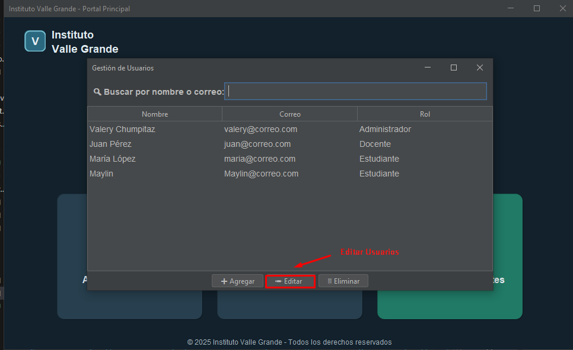
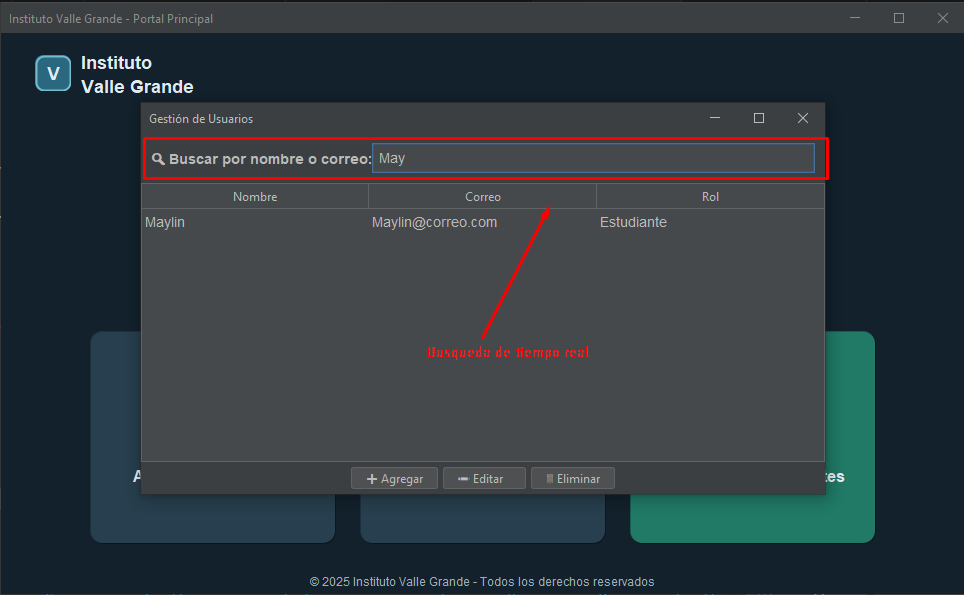
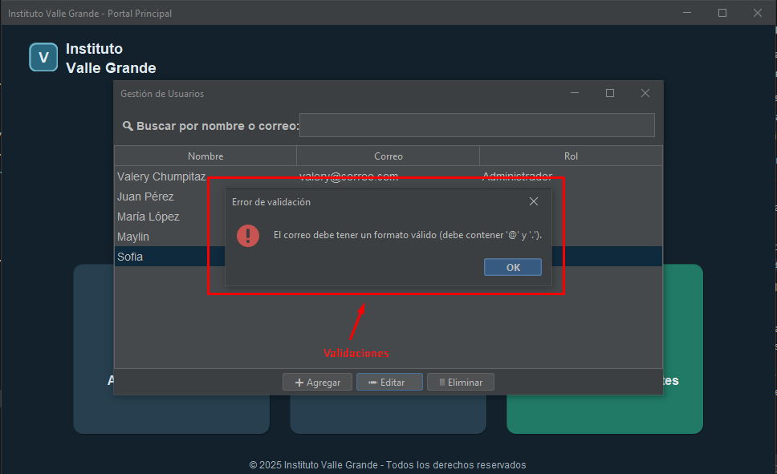

# Sistema de Gestión Académica - Instituto Valle Grande

Sistema de gestión académica con interfaz moderna desarrollado en Java Swing usando arquitectura MVC.

## 🎨 Mejoras de Interfaz Aplicadas

### Diseño Moderno con FlatLaf
- **Look & Feel oscuro**: Implementación de FlatLaf Dark para una apariencia moderna
- **Esquinas redondeadas**: Botones tipo "tarjeta" con bordes circulares personalizados
- **Paleta de colores consistente**: Tonos oscuros profesionales con buena legibilidad
- **Tipografía mejorada**: Fuentes SansSerif con jerarquía visual clara

#### Implementación de FlatLaf Dark
```java
// En App.java - Configuración del Look & Feel
import com.formdev.flatlaf.FlatDarkLaf;
import com.formdev.flatlaf.FlatLaf;

public class App {
    public static void main(String[] args) {
        SwingUtilities.invokeLater(() -> {
            try {
                // Configurar FlatLaf Dark como Look & Feel
                FlatLaf.setup(new FlatDarkLaf());
                JFrame.setDefaultLookAndFeelDecorated(true);
            } catch (Exception ignored) {}
            
            UsuarioController controller = new UsuarioController();
            new MiniPaginaView(controller).setVisible(true);
        });
    }
}
```

```xml
<!-- En pom.xml - Dependencia de FlatLaf -->
<dependencies>
  <dependency>
    <groupId>com.formdev</groupId>
    <artifactId>flatlaf</artifactId>
    <version>3.4.1</version>
  </dependency>
</dependencies>
```

#### Botones Personalizados con Esquinas Redondeadas
```java
// En MiniPaginaView.java - Clase CardButton personalizada
private static class CardButton extends JButton {
    private final int arc;
    private final Color bg;

    public CardButton(String text, int arc, Color background) {
        super(text);
        this.arc = arc;
        this.bg = background;
        setFocusPainted(false);
        setBorderPainted(false);
        setContentAreaFilled(false);
        setOpaque(false);
    }

    @Override
    protected void paintComponent(Graphics g) {
        Graphics2D g2 = (Graphics2D) g.create();
        g2.setRenderingHint(RenderingHints.KEY_ANTIALIASING, RenderingHints.VALUE_ANTIALIAS_ON);
        int w = getWidth();
        int h = getHeight();
        
        // Sombra suave para efecto de profundidad
        for (int i = 6; i >= 1; i--) {
            int alpha = 12 - i;
            g2.setColor(new Color(0, 0, 0, 10 + alpha));
            g2.fillRoundRect(2 + i, 3 + i, w - 1 - (i * 2), h - 1 - (i * 2), arc + i, arc + i);
        }
        
        // Fondo del botón
        g2.setColor(bg);
        g2.fillRoundRect(0, 0, w - 1, h - 1, arc, arc);
        
        // Borde sutil
        g2.setColor(new Color(0, 0, 0, 60));
        g2.drawRoundRect(0, 0, w - 1, h - 1, arc, arc);
        g2.dispose();
        super.paintComponent(g);
    }
}
```

### Interfaz Principal (MiniPaginaView)
- **Header con logo**: Badge personalizado con "V" y texto "Instituto Valle Grande" en dos líneas
- **Título centrado**: "Bienvenido al Portal del Instituto Valle Grande" posicionado correctamente
- **Tarjetas interactivas**: Botones de 300x150px con íconos grandes (👤, 👨‍🎓, 🎓)
- **Sombras sutiles**: Efectos de profundidad para mejor experiencia visual
- **Layout responsivo**: Distribución equilibrada con márgenes apropiados

## ✏️ Funcionalidad de Edición de Usuarios

### Cómo Usar la Edición
1. **Acceder**: Desde la pantalla principal → "Administrar Usuarios"
2. **Seleccionar**: Hacer clic en cualquier fila de la tabla
3. **Editar**: Presionar el botón "✏️ Editar"
4. **Modificar**: Se abren cuadros de diálogo pre-rellenados con los datos actuales
5. **Confirmar**: Los cambios se guardan automáticamente

### Validaciones Implementadas
- **Campos obligatorios**: Ningún campo puede quedar vacío
- **Formato de correo**: Debe contener "@" y "." en posiciones válidas
- **Roles válidos**: Solo acepta "Administrador", "Docente" o "Estudiante"
- **Mensajes claros**: Errores específicos para cada tipo de validación

## 🔍 Sistema de Búsqueda en Tiempo Real

### Características
- **Campo de búsqueda**: Ubicado arriba de la tabla con ícono 🔍
- **Filtrado instantáneo**: Busca mientras escribes, sin necesidad de presionar Enter
- **Búsqueda flexible**: Encuentra coincidencias parciales en nombre O correo
- **Case-insensitive**: No distingue entre mayúsculas y minúsculas

### Ejemplos de Uso
```
Escribir "val" → Muestra "Valery Chumpitaz"
Escribir "@correo" → Muestra usuarios con correos que contengan "@correo"
Campo vacío → Muestra todos los usuarios
```

## 💾 Sistema de Persistencia Automática

### Funcionamiento
- **Archivo CSV**: Los datos se guardan en `usuarios.csv` en el directorio del proyecto
- **Carga automática**: Al iniciar la aplicación, carga todos los usuarios guardados
- **Guardado automático**: Cada cambio (agregar/editar/eliminar) se guarda inmediatamente
- **Datos por defecto**: Si no existe archivo, crea usuarios de ejemplo

### Formato del Archivo
```csv
Nombre,Correo,Rol
Valery Chumpitaz,valery@correo.com,Administrador
Juan Pérez,juan@correo.com,Docente
María López,maria@correo.com,Estudiante
```

### Beneficios
- ✅ Sin pérdida de datos al cerrar la aplicación
- ✅ Persistencia automática sin intervención del usuario
- ✅ Archivo portable compatible con Excel
- ✅ Manejo robusto de caracteres especiales

## 🏗️ Arquitectura del Sistema

**Componentes:**
- **Model**: Usuario.java
- **Controller**: UsuarioController.java, EstudianteController.java
- **View**: MiniPaginaView.java, UsuarioCrudView.java, EstudianteCrudView.java
- **Service**: UsuarioPersistenceService.java
- **App.java**: Punto de entrada con configuración de Look & Feel

## 📸 Capturas de Pantalla

### Pantalla Principal

*Interfaz principal con diseño moderno FlatLaf Dark, header con logo y tarjetas interactivas*

### Gestión de Usuarios - Vista Principal

*Tabla de usuarios con funcionalidad de búsqueda en tiempo real y botones de acción*

### Edición de Usuario

*Cuadros de diálogo para editar datos de usuario con validaciones*

### Búsqueda en Tiempo Real

*Filtrado instantáneo de usuarios por nombre o correo*

### Validaciones de Datos

*Mensajes de error amigables para validación de campos*

## 🚀 Compilación y Ejecución

**Requisitos**: Maven y Java 17+

```bash
# Compilar el proyecto
mvn compile

# Ejecutar la aplicación
mvn exec:java -Dexec.mainClass="vallegrande.edu.pe.App"

# O ejecutar directamente con Java
java -cp target/classes vallegrande.edu.pe.App
```

## 📋 Funcionalidades Completas

- ✅ **CRUD de Usuarios**: Crear, leer, actualizar y eliminar usuarios
- ✅ **Validación de Datos**: Campos obligatorios y formato de correo
- ✅ **Búsqueda en Tiempo Real**: Filtrado instantáneo por nombre o correo
- ✅ **Persistencia Automática**: Guardado y carga automática en CSV
- ✅ **Interfaz Moderna**: Diseño profesional con FlatLaf Dark
- ✅ **Experiencia de Usuario**: Mensajes claros y navegación intuitiva

